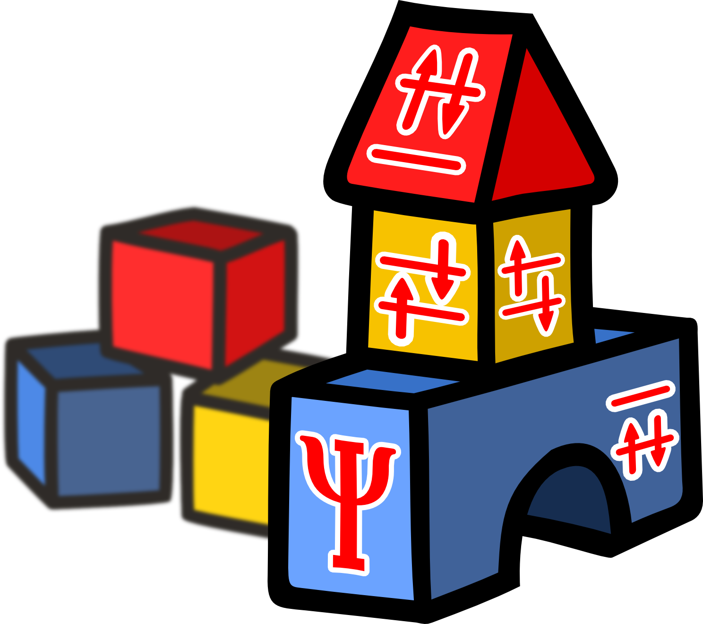

   
.. _`detCI\@ORBKIT`:

detCI\@ORBKIT
=============

detCI\@ORBKIT is an extension of ORBKIT for post-processing **multi-determinantal**
wave function data from the output of quantum chemical calculations.
Our procedure, allows to apply different one-electron operators to Configuration Interaction (CI) wave functions.
The main scope of this procedure is to analyze and visualize correlated electron dynamics
by interpreting several fundamental one-electron quantities, such as the :ref:`detCI:Electron Density`,
the transient :ref:`detCI:Electronic Flux Density` (also called Current Density), and the :ref:`detCI:Electronic Dipole Moment`.

For the theoretical background, details on the implementation, and the robustness of these quantities, see 

  Vincent Pohl, Gunter Hermann, and Jean Christophe Tremblay,
  `"An Open-Source Framework for Analyzing N-Electron Dynamics. I. Multideterminantal Wave Functions" <http://dx.doi.org/10.1002/jcc.24792>`_, 
  *J. Comput. Chem.* **2017**, *38*, 1515-1527.

  Vincent Pohl, Gunter Hermann, and Jean Christophe Tremblay,
  `"An Open-Source Framework for Analyzing N-Electron Dynamics. II. Hybrid Density Functional Theory/Configuration Interaction Methodology" <http://dx.doi.org/10.1002/jcc.24896>`_, 
  *J. Comput. Chem.* **2017**, `DOI:10.1002/jcc.24896 <http://dx.doi.org/10.1002/jcc.24896>`_.

Please cite this publication, if you use detCI\@ORBKIT in your work. 

We provide well documented example files for both model systems described in this publication in the `examples folder`__.
The procedure of how to operate detCI\@ORBKIT is described in detail in the following chapters.

__ https://github.com/orbkit/orbkit/tree/cython/examples/detci

**Table of Contents:**

.. toctree::
   :maxdepth: 4

   detci

   
.. hint::

  The paper is also freely available on arXiv: `detCI\@ORBKIT_I <https://arxiv.org/abs/1701.06885>`_ and `detCI\@ORBKIT_II <https://arxiv.org/abs/1704.08137>`_.

.. note::
  
  This section is under construction. If you have any questions,
  do not hesitate to contact us.
