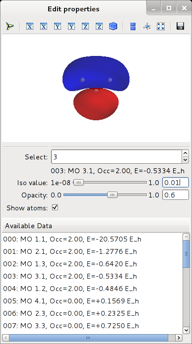

.. _`Quick Start Guide`:

Quick Start Guide
=================

This chapter shows a simple example of how to use ORBKIT. Here, we compute four molecular orbitals (HOMO-1, HOMO, LUMO,
and LUMO+1) of a water molecule and we demonstrate its quick visualization with VMD_ and Mayavi_. 
The execution is demonstrated within the Terminal and within a Python shell.

.. note ::

  We assume that you have followed the :ref:`installation-instructions` and that
  you have navigated to the folder ``$ORBKITPATH/examples/basic_examples``. For reasons of clarity, 
  we write all output in a subfolder named ``vis``:

  .. code-block:: bash

      $ cd $ORBKITPATH/examples/basic_examples
      $ mkdir vis

.. contents:: Table of Contents:
  :local:
  :depth: 2

Within the Terminal
-------------------

Using VMD
.........

The fastest and easiest way of preparing good-looking depictions of molecular orbitals or the electron 
density is by creating cube files and a VMD_ script. For non-commercial use,
VMD is a free program.

Now, let us run ORBKIT for a grid adapted to the molecular geometry 
(see :ref:`grid` for details):

.. code-block:: bash

    $ orbkit -i h2o.molden -o vis/h2o --otype=vmd --adjust_grid=5 0.5 --calc_mo=homo-1:lumo+2

ORBKIT creates four cube files and a VMD script file ``vis/h2o_MO.vmd``.
This can be displayed using VMD by calling

.. code-block:: bash

    $ vmd -e vis/h2o_MO.vmd

By default, ORBKIT uses absolute paths within the VMD script file.

.. hint::
   
   The orbital numbering corresponds to the indices within the input file (counting from **one**!).
   When you select a range of orbitals using a colon ":", please note that we are using the syntax of the Python range function,
   i.e., ``--calc_mo=START:STOP[:STEP]``, where ``STOP`` is **not** an element of the list.

Using Mayavi
............

To get a rough overview over the shape of the quantities computed, you can use a 
simple interface to Mayavi_. Although, **no** output file is created with that option,
you can combine it with other output options, e.g., ``--otype=vmd``.

Now, let us run ORBKIT for a grid adapted to the molecular geometry 
(see :ref:`grid` for details):

.. code-block:: bash

    $ orbkit -i h2o.molden --otype=mayavi --adjust_grid=5 0.5 --calc_mo=homo-1:lumo+2

    
When the computations are finished, the data will be depicted in an interactive window:

Within a Python Shell
---------------------

All tasks mentioned above can be directly performed within a Python shell.
This will be shown in the following, i.e., we will compute a set of molecular orbitals 
on a grid adjusted to the molecular geometry, and for the depiction, we will create both, a 
VMD_ script and a Mayavi_ scene.

Using ORBKIT's High-Level Interface
...................................

First, import the required python modules:

.. code-block:: python

    >> from orbkit import options, main

Set the options

.. code-block:: python

    >> options.filename = 'h2o.molden'
    >> options.outputname = 'vis/h2o'
    >> options.otype = ['vmd','mayavi']
    >> options.adjust_grid = [5,0.1]
    >> options.calc_mo = 'homo-1:lumo+2'

and run ORBKIT.

.. code-block:: python

    >> mo_list, mo_info = main.run_orbkit()

Using ORBKIT's Low-Level Interface
..................................

This task can also be accomplish by using the respective functions directly.
First, import the required python modules:

.. code-block:: python

    >> from orbkit import read, grid, extras, output, display

Read the input file,

.. code-block:: python

    >> qc = read.main_read('h2o.molden',itype='molden',all_mo=True)

initialize the grid,

.. code-block:: python

    >> grid.adjust_to_geo(qc,extend=5.0,step=0.1)
    >> grid.grid_init()
    >> display.display(grid.get_grid())

and run the calculation (incl. storage of the output)

.. code-block:: python

    >> mo_list, mo_info = extras.calc_mo(qc,'homo-1:lumo+2',otype=['vmd','mayavi'],ofid='vis/mo')

If you want to compute and depict other quantities than molecular orbitals, you can choose between
:mod:`orbkit.core.rho_compute` or :mod:`orbkit.extras.mo_set`. When you use :mod:`orbkit.core.rho_compute`
directly, you have to create the output by your own:

.. code-block:: python

    >> from orbkit import output
    >> output.main_output(mo_list,qc.geo_info,qc.geo_spec,outputname='vis/mo',otype=['vmd','mayavi'])

.. _VMD: http://www.ks.uiuc.edu/Research/vmd/
.. _Mayavi: http://docs.enthought.com/mayavi/mayavi/auto/examples.html
 
